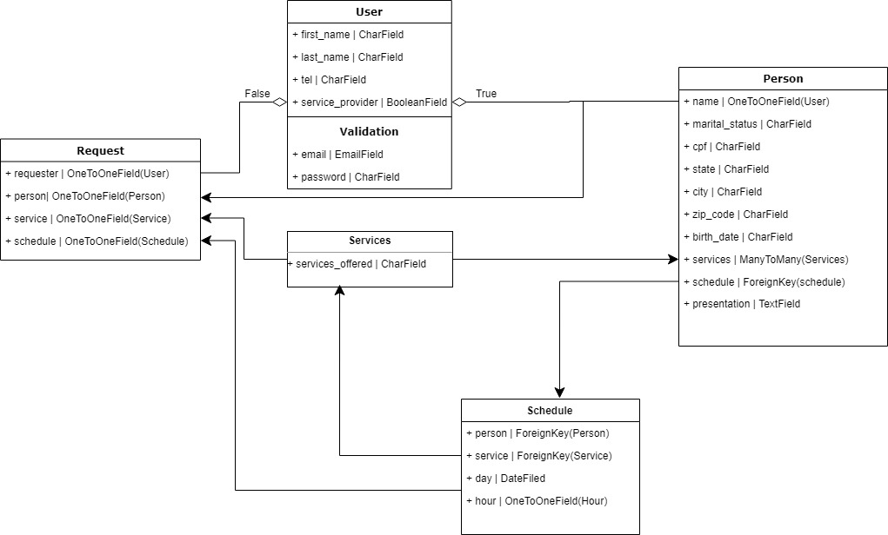

## Modelagem do banco

## Download & Instruções para instalação.

* 1 - Clone o projeto: git clone https://github.com/JonathaCnB/imersao-tce.git
* 2 - cd backend
* 3 - Criar virtual environment: python -m venv venv
* 4 - venv\scripts\activate
* 5 - pip install -r requirements.txt
* 6 - python manage.py migrate
* 7 - python manage.py createsuperuser
* 8 - python manage.py runserver

## Tasklist

- [X] Implementar modelo de user personalizado
- [ ] Criar models conforme modelagem
- [ ] Implementação da autenticação JWT
- [ ] CRUD Usuários

## Endpoints.

**User**:

* http://127.0.0.1:8000/api/users/register/
> Endpoint para registro de usuários.

* http://127.0.0.1:8000/api/users/login/
> Passando email e senha, assim você obterá seu token de acesso.

* http://127.0.0.1:8000/api/users/
> Listagem geral dos usuários.

* http://127.0.0.1:8000/api/users/profile/
> Perfil simples do usuário que fez a requisição.

* http://127.0.0.1:8000/api/users/update/:id/
> Alteração do perfil do usuário passando o ID, endpoint aguarda os fields: name, email e is_admin(Booleano)

* http://127.0.0.1:8000/api/users/delete/:id/
> Desativação do usuário, como boa prática acredito que nenhuma informação seja excluída apenas desativa.
